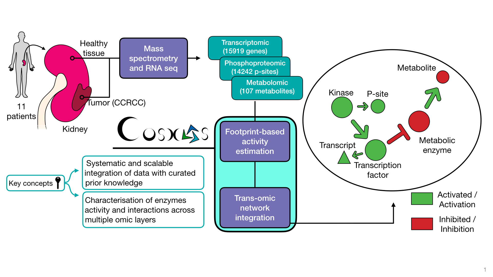

# cosmosR 

<!-- badges: start -->
[](https://github.com/saezlab/cosmosr/actions)
<!-- badges: end -->

## Overview

COSMOS (Causal Oriented Search of Multi-Omic Space) is a method that integrates phosphoproteomics, transcriptomics, and metabolomics data sets. COSMOS leverages extensive prior knowledge of signaling pathways, metabolic networks, and gene regulation  with computational methods to estimate activities of transcription factors and kinases as well as network-level causal reasoning. This pipeline can provide mechanistic explanations for experimental observations across multiple omic data sets. 


COSMOS finds coherent subnetwork causally connecting as many deregulated TFs, kinases/phosphatases and metabolites as possible. The subnetwork is extracted from a novel integrated PKN (available [here](http://metapkn.omnipathdb.org/)) spanning signaling, transcriptional regulation and metabolism.  Transcription factors activities are inferred from gene expression with [decoupleR](https://saezlab.github.io/decoupleR/). Kinase activities are inferred from phosphoproteomic with a kinase/substrate network of [Omnipath](http://omnipathdb.org/), a meta resource of protein-protein. The scripts to generate the current network can be found here: https://github.com/saezlab/meta_PKN_BIGG.


You can also use COSMOS if you don't have metabolomic data, to connect TF activities (from transcriptomic) with kinase activities (from phosphoproteomic) for exmaple !




## Installation

R >= 4.1 is required
```r
# install from bioconductor
if (!requireNamespace("BiocManager", quietly = TRUE))
    install.packages("BiocManager")

BiocManager::install("cosmosR")

# We advise to instal from github to get the latest version of the tool.
if (!requireNamespace("devtools", quietly = TRUE))
    install.packages("devtools")
    
devtools::install_github("saezlab/cosmosR")
```

If you don't have R 4.1, you can also clone the github repository on your machine, create a new R project with R studio from the cosmosR folder, change the R version to your own R version in the DESCRIPTION file and then install it with devtools:install()

But 4.1 is advised in any case.

## tutorial to use MOFA nad COSMOS

[Here](https://github.com/saezlab/Factor_COSMOS/) you can find an extensive tutorial showing how to use MOFA and COSMOS with the NCI60 dataset. This is an extensive tutorial, if you wish to get a quicker plug and play introduction to COSMOS, see below.

!!! THIS is were you can find the input data and the pre-processing scripts that corespond to the featured vignette !!!

## Tutorial (NCI60 playground)

We made a repository that contains pre-processed inputs and an example script to use cosmos with the NCI60 RNA+metabolomic datasets.
You can find the repository [here](https://github.com/saezlab/COSMOS_basic).

!!! THIS is were you can find the input data and the pre-processing scripts that corespond to the featured vignette !!!

## Access

The meta PKN used with the older biorXiv version of COSMOS (2021) is available [here](http://metapkn.omnipathdb.org/).

An updated meta PKN is available with the package (using data(meta_network) in R)

## Citation
If you use cosmosR for your research please cite the [original publication](https://www.embopress.org/doi/full/10.15252/msb.20209730): 

> Dugourd A, Kuppe C, Sciacovelli M, Gjerga E, Gabor A, Emdal KB, Vieira V, Bekker-Jensen DB, Kranz J, Bindels EMJ, Jesper V Olsen, Christian Frezza, Rafael Kramann, Julio Saez-Rodriguez et al (2021) Causal integration of multi-omics data with prior knowledge to generate mechanistic hypotheses. Mol Syst Biol 17: e9730

## License

The code is distributed under the GNU General Public License v3.0. The meta PKN is distributed under the Attribution-NonCommercial 4.0 International (CC-BY-NC 4.0) License.
