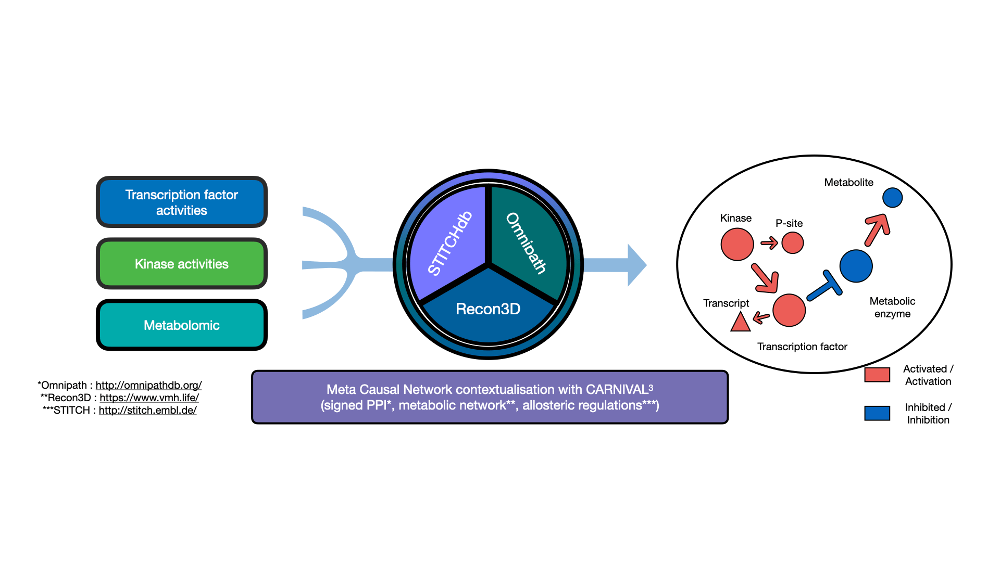

# COSMOS-tutorial

## Installation and dependency

COSMOS is dependent on CARNIVAL for exhibiting the signalling pathway
optimisation. CARNIVAL requires the interactive version of IBM Cplex or
CBC-COIN solver as the network optimiser. The IBM ILOG Cplex is freely
available through Academic Initiative
[here](https://www.ibm.com/products/ilog-cplex-optimization-studio). The
[CBC](https://projects.coin-or.org/Cbc) solver is open source and freely
available for any user, but has a significantly lower performance than
CPLEX. Obtain CBC executable directly usable for cosmos
[here](https://ampl.com/products/solvers/open-source/#cbc).
Alternatively for small networks, users can rely on the freely available
[lpSolve
R-package](https://cran.r-project.org/web/packages/lpSolve/index.html),
which is automatically installed with the package.

In this tutorial we use lpSolve, but we strongly recommend to obtain a
license for CPLEX.

``` r
# install from bioconductor
if (!requireNamespace("BiocManager", quietly = TRUE))
    install.packages("BiocManager")
BiocManager::install("cosmosR")


# install the newest (development) version from GitHub
# install.packages("remotes")
# install CARNIVAL from github 
remotes::install_github("saezlab/CARNIVAL")
remotes::install_github("saezlab/cosmosR")
```

## Introduction

COSMOS (Causal Oriented Search of Multi-Omic Space) is a method that
integrates phosphoproteomics, transcriptomics, and metabolomics data
sets. COSMOS leverages extensive prior knowledge of signaling pathways,
metabolic networks, and gene regulation with computational methods to
estimate activities of transcription factors and kinases as well as
network-level causal reasoning. This pipeline can provide mechanistic
explanations for experimental observations across multiple omic data
sets.


data_intro_figure

Essentially, COSMOS has 3 main components:

- The prior knowledge: The goal of COSMOS is essentially to connect
  various deregulation events together with mechanistic hypotheses.
  Those mechanistic hypotheses are basically known potential
  interactions between molecular biology features, such as proteins and
  metabolites. An example of such interaction can be the activation of
  MTOR by AKT, in the EGFR canonical pathway. Thousands of such
  potential interaction can be assembled together to form a large
  network of interactions. Such networks are thus called prior knowledge
  networks (PKN), because they summarize large amounts of prior
  knowledge in the form of a network. In the context of COSMOS this
  interactions come from the Omnipath database, STICHdb and the recon3D
  reaction network. With respect to the example interaction between MTOR
  and AKT, the question that is usually asked when presented with a
  given experimental context is: while MTOR can activate AKT in general,
  is this interaction relevant in my experimental context? This brings
  us to the second component of COSMOS.

- The data: Information about deregulated transcription factors (TF),
  kinases/phosphophatases and metabolites can be extracted from
  transcriptomic, phospho-proteomic or metabolomic data respectively,
  using footprint analysis methods
  (see:<https://github.com/saezlab/transcriptutorial> (Especially
  chapter 4)). Such information can be quite useful by itself, to
  characterize which TFs or kinases are specifically deregulated in
  cancer cells for example. the goal of COSMOS is to find how these
  different deregulation events can be connected together. Going back to
  the example of MTOR and AKT, if I know that AKT can potentially
  activate MTOR, and I observe in my data that both AKT and MTOR are
  significantly activated in cancer tissue compared to their healthy
  counterpart, there is a reasonable chance that this interaction is
  active in the cancer tissue I’m studying. The problem is that data
  often contain information about hundreds of up and down-regulated
  activities at the same time, and thousands of potential interactions
  can potentially explain them. In order to find the optimal set of
  interactions that are relevant to explain the deregulation observed in
  my data, an algorithm is needed.

- The algorithm: The problem described in the data part is formulated as
  an integer linear optimisation problem. The PKN and the data can be
  abstracted as a large set of integer variables operating together in
  an even larger set of equations (see
  <https://www.nature.com/articles/s41540-019-0118-z> for more info).
  Given a set of fixed value for the variable (that is, a subset of the
  known deregulation), we need to find the values for the other sets of
  variable (corresponding to proteins and metabolites for which we have
  no information in our data) that can lead to a satisfying result. A
  satisfying results in the context of COSMOS represent a sub-network of
  interactions that is as small as possible while coherently explaining
  as many of our known deregulation as possible. Thus, the set of
  equation mentioned earlier needs to be solved, using an integer linear
  programming solver. The solvers that are currently available for
  COSMOS are lpsolve, cbc and cplex. In general, CPLEX is preferred over
  CBC for most real case applications, while lpsolve is mainly used for
  testing with small networks and sets of measurements.



Summary figure

## Tutorial section: signaling to metabolism

First, we load the package

``` r
library(cosmosR)
```

In this part, we can set up the options for the CARNIVAL run, such as
timelimit and min gap tolerance.

The user should provide a path to its CPLEX/cbc executable.

You can check the CARNIVAL_options variable to see all possible options
that can be adjusted

In this example, we will use the built-in solver lpSolve. User should be
aware that lpSolve should ONLY be used for TESTS. To obtain meaningful
results, best solver is cplex, or cbc if not possible.

``` r
CARNIVAL_options <- default_CARNIVAL_options(solver = "lpSolve")

# To use CBC
# CARNIVAL_options <- default_CARNIVAL_options(solver = "cbc")
# CARNIVAL_options$solverPath <- "~/Documents/cbc"
# CARNIVAL_options$threads <- 2
# CARNIVAL_options$mipGAP <- 0.05

# To use CPLEX:
# CARNIVAL_options <- default_CARNIVAL_options(solver = "cplex")
# CARNIVAL_options$solverPath <- "C:/Program Files/CPLEX_solver/cplex/bin/x64_win64/cplex.exe"
# CARNIVAL_options$threads <- 2
# CARNIVAL_options$mipGAP <- 0.05


CARNIVAL_options$timelimit <- 3600
```

In the next section, we prepare the input to run cosmosR. The signaling
inputs are the result of footprint based TF and kinase activity
estimation. For more info on TF activity estimation from transcriptomic
data, see:<https://github.com/saezlab/transcriptutorial> (Especially
chapter 4)

Here we use of toy PKN, to see the full meta PKN, you can load it with
data(meta_network). To see how is the meta_PKN assembled, see:
<https://github.com/saezlab/meta_PKN_BIGG.git>

The metabolites in the prior knowledge network are identified as
XMetab\_\_HMDBid_compartment or XMetab\_\_BIGGid_compartment (for
example “Metab\_\_HMDB0000190_c”). The compartment code is the BIGG
model standard (r, c, e, x, m, l, n, g). Thus we will first need to map
whatever identifier for metabolite the data has to the one of the
network. Genes are identified as gene symboles (in the signaling part of
network) or Gene####\_\_symbole (in the reaction network part of
network).

The maximum network depth will define the maximum number of step
downstream of kinase/TF COSMOS will look for deregulated metabolites.
Good first guess for max depth could be around between 4 and 6 (here it
is 15 for the toy dataset)

The differential experession data is used to filter out wrong TF-target
interactions in this context after a pre-optimisation.

The list of genes in the differential expression data will also be used
as a reference to define which genes are expressed or not (all genes in
the diff_expression_data are considered expressed, and genes that are no
in diff_expression_data are removed from the network).

Here, the CARNIVAL_options\$timelimit is set for the pre-optimisation.
Indeed, if the “filter_tf_gene_interaction_by_optimization” parameter of
the “preprocess_COSMOS_signaling_to_metabolism” function is set to TRUE,
COSMOS can perform a first optimisation run in order to generate a
preliminary solution network that can be used for filtering out
incoherences between TF activities and downstream target expressions.

``` r
data(toy_network)
data(toy_signaling_input)
data(toy_metabolic_input)
data(toy_RNA)
test_for <- preprocess_COSMOS_signaling_to_metabolism(meta_network = toy_network,
                                        signaling_data = toy_signaling_input,
                                        metabolic_data = toy_metabolic_input,
                                                      diff_expression_data = toy_RNA,
                                                      maximum_network_depth = 15,
                                                      remove_unexpressed_nodes = TRUE,
                                                      CARNIVAL_options = CARNIVAL_options)
```

    ## [1] "COSMOS: all 3 signaling nodes from data were found in the meta PKN"
    ## [1] "COSMOS: all 2 metabolic nodes from data were found in the meta PKN"
    ## [1] "COSMOS: 2975 of the 9300 genes in expression data were found as transcription factor target"
    ## [1] "COSMOS: 2975 of the 5321 transcription factor targets were found in expression data"
    ## [1] "COSMOS: removing unexpressed nodes from PKN..."
    ## [1] "COSMOS: 0 interactions removed"
    ## [1] "COSMOS: removing nodes that are not reachable from inputs within 15 steps"
    ## [1] "COSMOS: 0 from  101 interactions are removed from the PKN"
    ## [1] "COSMOS: removing nodes that are not observable by measurements within 15 steps"
    ## [1] "COSMOS: 52 from  101 interactions are removed from the PKN"
    ## [1] "COSMOS: 2 input/measured nodes are not in PKN any more: USF1, SRF and 0 more."
    ## [1] "COSMOS:  0 interactions are removed from the PKN based on consistency check between TF activity and gene expression"
    ## [1] "lpSolve does not scale well with large PKNs. This solver is mainly for testing purposes. To run COSMSO, we recommend using cplex, or cbc solvers."
    ## [1] "lpSolve does not scale well with large PKNs. This solver is mainly for testing purposes. To run COSMSO, we recommend using cplex, or cbc solvers."

    ## [1] "COSMOS:  0 interactions are removed from the PKN based on consistency check between TF activity and gene expression"
    ## [1] "COSMOS: all 1 signaling nodes from data were found in the meta PKN"
    ## [1] "COSMOS: all 2 metabolic nodes from data were found in the meta PKN"
    ## [1] "COSMOS: 2975 of the 9300 genes in expression data were found as transcription factor target"
    ## [1] "COSMOS: 2975 of the 5321 transcription factor targets were found in expression data"

In this part, we can set up the options for the actual run, such as
timelimit and min gap tolerance.

The running time should be much higher here than in pre-optimisation.
You can increase the number of threads to use if you have many available
CPUs.

``` r
CARNIVAL_options$timelimit <- 14400
CARNIVAL_options$mipGAP <- 0.05
CARNIVAL_options$threads <- 2
```

This is where cosmosR run.

``` r
test_result_for <- run_COSMOS_signaling_to_metabolism(data = test_for,
                                                      CARNIVAL_options = CARNIVAL_options)
```

    ## [1] "lpSolve does not scale well with large PKNs. This solver is mainly for testing purposes. To run COSMSO, we recommend using cplex, or cbc solvers."

    ## [1] "lpSolve does not scale well with large PKNs. This solver is mainly for testing purposes. To run COSMSO, we recommend using cplex, or cbc solvers."

Finally, we process the results of the first cosmosR run, to translate
gene names and metabolites name.

``` r
formated_result_for <- format_COSMOS_res(test_result_for)
```

## Tutorial section: metabolism to signaling

Before we run the metabolism to signaling part, we need to prepare again
the inputs.

``` r
CARNIVAL_options$timelimit <- 3600
CARNIVAL_options$mipGAP <- 0.05
CARNIVAL_options$threads <- 2
```

Now that the correct time is set up for the pre-optimisation run, we can
prepare the inputs.

``` r
test_back <- preprocess_COSMOS_metabolism_to_signaling(meta_network = toy_network,
                                        signaling_data = toy_signaling_input,
                                        metabolic_data = toy_metabolic_input,
                                                       diff_expression_data = toy_RNA,
                                                       maximum_network_depth = 15,
                                                       remove_unexpressed_nodes = FALSE,
                                                       CARNIVAL_options = CARNIVAL_options)
```

    ## [1] "COSMOS: all 3 signaling nodes from data were found in the meta PKN"
    ## [1] "COSMOS: all 2 metabolic nodes from data were found in the meta PKN"
    ## [1] "COSMOS: 2975 of the 9300 genes in expression data were found as transcription factor target"
    ## [1] "COSMOS: 2975 of the 5321 transcription factor targets were found in expression data"
    ## [1] "COSMOS: removing nodes that are not reachable from inputs within 15 steps"
    ## [1] "COSMOS: 0 from  101 interactions are removed from the PKN"
    ## [1] "COSMOS: removing nodes that are not observable by measurements within 15 steps"
    ## [1] "COSMOS: 54 from  101 interactions are removed from the PKN"
    ## [1] "COSMOS: 1 input/measured nodes are not in PKN any more: Metab__HMDB0000190_c and 0 more."
    ## [1] "COSMOS:  0 interactions are removed from the PKN based on consistency check between TF activity and gene expression"
    ## [1] "lpSolve does not scale well with large PKNs. This solver is mainly for testing purposes. To run COSMSO, we recommend using cplex, or cbc solvers."
    ## [1] "lpSolve does not scale well with large PKNs. This solver is mainly for testing purposes. To run COSMSO, we recommend using cplex, or cbc solvers."

    ## [1] "COSMOS:  0 interactions are removed from the PKN based on consistency check between TF activity and gene expression"
    ## [1] "COSMOS: all 3 signaling nodes from data were found in the meta PKN"
    ## [1] "COSMOS: all 1 metabolic nodes from data were found in the meta PKN"
    ## [1] "COSMOS: 2975 of the 9300 genes in expression data were found as transcription factor target"
    ## [1] "COSMOS: 2975 of the 5321 transcription factor targets were found in expression data"

Then we can run cosmosR to connect metabolism to signaling. The running
time here usually needs to be longer, as this problem seems to be harder
to solve for CPLEX.

``` r
CARNIVAL_options$timelimit <- 28800

test_result_back <- run_COSMOS_metabolism_to_signaling(data = test_back,
                                                       CARNIVAL_options = CARNIVAL_options)
```

    ## [1] "lpSolve does not scale well with large PKNs. This solver is mainly for testing purposes. To run COSMSO, we recommend using cplex, or cbc solvers."

    ## [1] "lpSolve does not scale well with large PKNs. This solver is mainly for testing purposes. To run COSMSO, we recommend using cplex, or cbc solvers."

Finally we can format the result of the backward run as well (same as
for forward run)

``` r
formated_result_back <- format_COSMOS_res(test_result_back)
```

## Tutorial section: Merge forward and backward networks and visualise network

Here we simply take the union of forward and backward runs to create a
full network solution lopping between signaling, gene-regulation and
metabolism. Since there is an overlap between the result network of
forward and backward run, you may optionally want to check if there are
any node sign that are incoherent in the overlap between the two
solutions.

``` r
full_sif <- as.data.frame(rbind(formated_result_for[[1]], formated_result_back[[1]]))
full_sif <- full_sif[full_sif$Weight>0,]
full_attributes <- as.data.frame(rbind(formated_result_for[[2]], formated_result_back[[2]]))

full_sif <- unique(full_sif)
full_attributes <- unique(full_attributes)
```

This function will generate a dynamic network plot centered on a given
node of the network solution, and connecting it to measured nodes in the
given range (here 7 steps).

``` r
network_plot <- display_node_neighboorhood(central_node = 'Metab__D-Glucitol_c', 
                                           sif = full_sif, 
                                           att = full_attributes, 
                                           n = 7)

network_plot
```

Here is how this network can be intepreted (this is purely illustrative,
as some of those interaction may be incorectly signed because lpsolve
can only use positive interactions):

This network represents the flow of activities that can connect MYC
up-regulation with Glucitol (Sorbitol) accumulation. Here, NFKB1 can
upregulate the expression of SLC2A1, which in turn transport more
glucose in the cytoplasm. The increase transport of glucose can lead to
more glucose being avlaible for conversion into glucitol by the AKR1A
enzyme. Interestingly, glucitol is a now activator of MAPK14, thus
leading to the appearance of a positive feedback loop connecting MYC,
glucitol and MAPK14.

It is important to understand that each of this links is hypothetical.
The come from a larger pool of potential molecular interactions present
in multiple online databases and compiled in omnipath, STITCH and recon
metabolic network. They exist in the literature and are interactions
that are known to potentially exists in other experimental contexts.
Thus, COSMOS compile all those potential interactions together and
proposes a coherent set that can explain the data at hand.

Those links should however be considered only as potential mechanistic
connections, and will need to be further confirmed experimentally. Those
interactions can be searched in the literature to see in which other
disease or experimental context they have been shown to be relevant.
Taken together, multiple interactions can help to build a biological
story that can guide further underatanding of the underlying biology and
decide on future experiments.

## Tutorial section: Over Representation Analysis

Often it is useful to perform an Over Representation Analysis (ORA) on
the resulting nodes of a COSMOS network as a first analysis step to get
a more functional interpretation on the modeled signaling cascade. A
common way to this is to test whether the selected genes (nodes) in the
COSMOS solution network show statistically significant differences in
comparison to the prior-knowledge network (PKN).

The differentially expressed genes give information about the cellular
processes that are deregulated and if the proportions in various
pathways are SIGNIFICANTLY different from what is expected.In this way
the significant differences between two biological conditions
(e.g. cancer vs. normal tissue, or treatment vs. untreated cells) can be
shown.

Algorithms that perform an ORA are implemented in other R packages like
piano or decoupleR. In addition to a gene set collection these
algorithms require two different lists as inputs: - nodes in the COSMOS
solution network which relate back to the input data
(e.g. transcriptomics, proteomics, metabolomics, fluxomics, or
perturbations) - all nodes (kinases, transcription factors, metabolites)
in the prior-knowledge network (which are used as the background in our
analysis)

In this section we will show how to obtain these two lists from a
formated COSMOS result object.

``` r
sif_forward = formated_result_for[[1]]
att_forward = formated_result_for[[2]]
nodes_ORA = extract_nodes_for_ORA(
    sif = sif_forward, 
    att = att_forward)
```

Now this forward and backward sets can be used with any ORA analysis.

``` r
sessionInfo()
```

    ## R version 4.4.1 (2024-06-14)
    ## Platform: x86_64-pc-linux-gnu
    ## Running under: Ubuntu 22.04.4 LTS
    ## 
    ## Matrix products: default
    ## BLAS:   /usr/lib/x86_64-linux-gnu/openblas-pthread/libblas.so.3 
    ## LAPACK: /usr/lib/x86_64-linux-gnu/openblas-pthread/libopenblasp-r0.3.20.so;  LAPACK version 3.10.0
    ## 
    ## locale:
    ##  [1] LC_CTYPE=en_US.UTF-8       LC_NUMERIC=C              
    ##  [3] LC_TIME=en_US.UTF-8        LC_COLLATE=en_US.UTF-8    
    ##  [5] LC_MONETARY=en_US.UTF-8    LC_MESSAGES=en_US.UTF-8   
    ##  [7] LC_PAPER=en_US.UTF-8       LC_NAME=C                 
    ##  [9] LC_ADDRESS=C               LC_TELEPHONE=C            
    ## [11] LC_MEASUREMENT=en_US.UTF-8 LC_IDENTIFICATION=C       
    ## 
    ## time zone: UTC
    ## tzcode source: system (glibc)
    ## 
    ## attached base packages:
    ## [1] stats     graphics  grDevices utils     datasets  methods   base     
    ## 
    ## other attached packages:
    ## [1] cosmosR_1.9.1
    ## 
    ## loaded via a namespace (and not attached):
    ##  [1] bcellViper_1.40.0   sass_0.4.10         generics_0.1.4     
    ##  [4] tidyr_1.3.1         lpSolve_5.6.23      stringi_1.8.7      
    ##  [7] lattice_0.22-7      hms_1.1.4           digest_0.6.39      
    ## [10] magrittr_2.0.4      evaluate_1.0.5      grid_4.4.1         
    ## [13] fastmap_1.2.0       jsonlite_2.0.0      Matrix_1.7-4       
    ## [16] progress_1.2.3      purrr_1.2.0         codetools_0.2-20   
    ## [19] textshaping_1.0.4   jquerylib_0.1.4     cli_3.6.5          
    ## [22] rlang_1.1.6         decoupleR_2.10.0    crayon_1.5.3       
    ## [25] visNetwork_2.1.4    parallelly_1.45.1   bit64_4.6.0-1      
    ## [28] withr_3.0.2         cachem_1.1.0        yaml_2.3.11        
    ## [31] tools_4.4.1         parallel_4.4.1      tzdb_0.5.0         
    ## [34] BiocParallel_1.38.0 dplyr_1.1.4         vctrs_0.6.5        
    ## [37] R6_2.6.1            lifecycle_1.0.4     stringr_1.6.0      
    ## [40] bit_4.6.0           fs_1.6.6            htmlwidgets_1.6.4  
    ## [43] vroom_1.6.7         ragg_1.5.0          pkgconfig_2.0.3    
    ## [46] desc_1.4.3          pkgdown_2.2.0       pillar_1.11.1      
    ## [49] bslib_0.9.0         glue_1.8.0          systemfonts_1.3.1  
    ## [52] xfun_0.54           tibble_3.3.0        tidyselect_1.2.1   
    ## [55] knitr_1.50          CARNIVAL_2.14.0     dorothea_1.16.0    
    ## [58] rjson_0.2.23        htmltools_0.5.9     igraph_2.2.1       
    ## [61] rmarkdown_2.30      readr_2.1.6         compiler_4.4.1     
    ## [64] prettyunits_1.2.0
